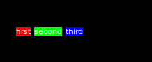

# awesome-widgets

yep it's another awesomeWM thing of mine.

This is just a collection of widgets I made that some other people might
actually like because they're kinda useful. I will probably continue adding to
this as I make more widgets that other people might find useful. I'll also
outline what each of the widgets do.

# animated icons

currently available: hamburger and playpause

These are quite simply animated icons. You call `set(self, pos)` for some pos
from 0-1 and they'll animate to that position. Requires my animation library,
rubato. They're vaugely material-design-esque and they're also pure white with
much of their stuff hardcoded but at least you won't have to do all that manual
cairo animation yourself if you pick these up. At some point I'll make gifs for
these when I actually implement them in my new rice or if I find my old videos
of them.

# slider

This is an improved version of the awesome slider. The handle fades out
slightly when you hover over it, it has as subtle lag to its movement using
rubato, and probably other stuff that I've since forgot but I think I also made
better signals. It's probably worth using if the stock awesome slider didn't
cut it for whatever reason (I think I made it because it wouldn't tell me when
I was hovering over the handle) and while it's not super useful in it's current
state its a good foundation if you wanted to do more complicated
handle-hover-things. It's not particularly well documented but it's pretty
useful regardless

# coolwidget

Okay this one's actually really cool. It takes long widget-chains and turms
them into not-so-long singular widgets, effectively flattening your tables.
This is super nice when making more complex widgets as these tables tend to
stack up fast. Here's two declarations of the same widget, one using coolwidget
and one just using the normal awesome widget system:

default:
```lua
local w = wibox.widget {
	{
		{
			{
				{
					{
						{
							wibox.container.background(wibox.widget.textbox("first"), "#ff0000"),
							right = 5,
							widget = wibox.container.margin
						},
						{
							wibox.container.background(wibox.widget.textbox("second"), "#00ff00"),
							right = 5,
							widget = wibox.container.margin
						},
						wibox.container.background(wibox.widget.textbox("third"), "#0000ff")
					},
					layout = wibox.layout.align.horizontal
				},
				widget = wibox.container.align
			},
			valign = "center",
			widget = wibox.container.place
		},
		widget = wibox.container.margin,
		left = 25
	},
	bg = "#000000",
	widget = wibox.container.background
}
```

mine:
```lua
wibox.widget {
	wibox.container.background(wibox.widget.textbox("first"), "#ff0000"),
	wibox.container.background(wibox.widget.textbox("second"), "#00ff00"),
	wibox.container.background(wibox.widget.textbox("third"), "#0000ff"),
	spacing = 5,
	halign = "left",
	valign = "center",
	bg = "#000000",
	left = 25,
	layout = coolwidget.background.margin.place.align.horizontal
},
```

what it looks like:



Only caviats are that you can't have multiple of the same container (since it
wouldn't know which one to apply the property to) and I've only set it up for a
couple container types. Luckily the latter is easily solved, since there's just
a `PROPERTIES` constant which can be easily modified by adding an entry where
the key is the container name and the values are the constants assigned to it.
Other than that you can basically just treat it like a single widget with all
of the properties it would normally have.

Align layouts are also a little different, where I added spacing (not real
spacing, I just did it with a margin layout) and more intuitive expand options
(`default`, `expfirst` where it only has two widgets and expands the first,
`explast`, the opposite of `expfirst`, and `neither`, where it expands neither and
pushes both to the ends of the space)

# recycler

This one is also really cool. Basically it recycles widgets (who could've
guessed with a name like that!). When you remove a widget, instead of just
evaporating it, it saves its basic structure and allows it to be called later.
To use it, you must have a special widget-constructor-function-thing and to add
a widget to the layout, instead of adding an actual widget object, you just add
the arguments you would give to said constructor. The widgets created by the
constructor must have the method `populate` so it knows what to do with the
arguments. A minimal example: ```lua local recycler = require
"lib.awesome-widgets.recycler" local layout = recycler(function(str) local w =
wibox.widget.textbox() function w:populate(str) self.text = str end return w
end)

recycler:add("dog") --adds it recycler:remove_by_args("dog") --removes it
recycler:add_at(1, "doggo") --adds "doggo" at position 1
recycler:set_children("dog1", "dog2", "dog3") --removes all existing widgets and
adds these three recycler:remove_at(2) --removes "dog2" ``` this creates a
recycler that generates simple textboxes. here's the actual api:

**initialization** `recycler(constructor, arguments)`
 - `constructor` must return a widget with the method `populate`. It will be
   called as a method (with a `:`) and should make the widget look how you want
   it to look with the given arguments. Arguments to populate can be anything,
   but tables are suggested (for preventing collisions in `remove_by_args`) and
   it will only use the first element to index itself in the internal table
   `by_args`.
 - `arguments` table containing any of the values outlined in the **Arguments**
   section

**Arguments**
 - `pady` y padding. It's suggested to use this instead of a margin layout so
   your flyin/outs can have enough space to animate correctly. Also, if
   orientation is `LEFT` or `RIGHT` then the x padding and y padding switch
   because it'd actually be kinda annoying to do otherwise (but if it irks you
   and you wanna change it feel free to make a pull request) (def `8`)
 - `padx` x padding. (def `8`)
 - `spacing` spacing between widgets (def. same as `pady`)
 - `fadedist` distance the widget will travel while fading in or out (def.
   `spacing / 2`)
 - `scalex` scale distance it travels in the x direction while fading in/out
   (def. `0`)
 - `scaley` scale distance it travels in the y direction while fading in/out
   (def. `1`)
 - `inout_const` constructor for inout rubato timed object (def. `function()
   return rubato.timed { duration = 0.2, intro = 0.3, prop_intro = true } end`)
 - `pos_const` constructor for position rubato timed object (def. `function()
   return rubato.timed { duration = 0.2, intro = 0.3, prop_intro = true } end`)

**Methods**
 - `recycler:add(args)` adds a widget with the given arguments. Arguments must
   be in the form of a single table otherwise `get_by_args` won't work. The
   arguments will then be passed to the widget's `populate` method. Returns the
   added widget and the position it was added to.
 - `recycler:add_at(pos, args)` adds a widget with the given arguments at a
   specific position. Is otherwise identical to add. Returns the new widget and
   the position it was added to.
 - `recycler:remove(w)` removes a widget. w is a widget object. Returns the
   removed widget and the position it was removed from.
 - `recycler:remove_at(pos)` removes a widget at the specified position. Is
   otherwise identical to remove. returns the removed widget and the position it
   was removed from.
 - `recycler:remove_by_args(args)` removes a widget by the arguments given to
   it. Since the arguments were given in the form of the table, you don't really
   need to worry about collision. It's usually easier to identify widgets by the
   arguments you passed in rather than the widget itself or its position.
   Returns the removed widget and the position it was removed from.
 - `recycler:get_by_args(args)` returns the widget that was created using the
   given arguments
 - `recycler:set_children(...)` takes an indefinite amount of tables of
   arguments (as you would pass to 
 - `recycler:get_children()` get all visible widgets

**NOTE:** make sure to reset everything in the `populate` method. If your
widget's size would change with different values given to `populate`, make sure
to call `mywidget:emit_signal("widget::redraw_needed")` so it can get the new
size correctly.

# TODO:
- [ ] add gifs
- [X] add that super duper ultra cool slider I made
- [ ] do more aniamted widgets
- [ ] make cooler
- [ ] make more customizable and just move all this stuff to bling
- [X] organize the project with folders and stuff
- [ ] use real spacing with `layout` instead of margin layouts for alignplus
